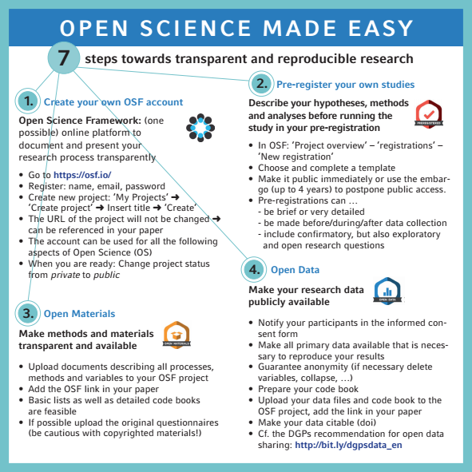

# <small> What we did last time... </small>

----

The hypothetico-deductive model (Munafo et al. 2017)  
  
<small>Source (edited): https://media.nature.com/lw926/nature-assets/nathumbehav/2017/s41562-016-0021/images_hires/s41562-016-0021-f1.jpg</small>

----

Any questions or anything to add?

# <small>Today: Open science to the rescue</small>

# <small>Seven easy steps for open science</small>

----

  
<small>Source: https://mfr.osf.io/render?url=https://osf.io/hktmf/?action=download%26mode=render</small>

----

  
<small>Source: https://mfr.osf.io/render?url=https://osf.io/hktmf/?action=download%26mode=render</small>

# <small>Any more questions?</small>

# <small>Next session preview</small>

----

Digital open scientist's toolbox - Part I

# <small>Homework</small>

----

Get an account at <a href="https://osf.io">https://osf.io</a>

----

Send your email address to  <a href="mailto:m.weiler@fu-berlin.de">m.weiler@fu-berlin.de</a>

# Thank you for your attention
