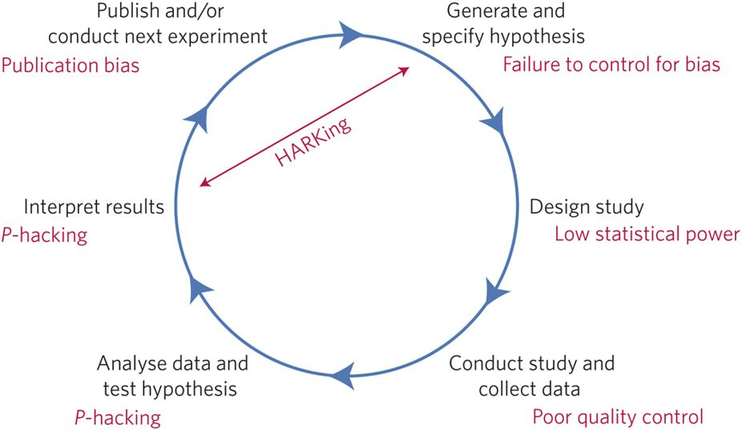

# <small> What we did last time... </small>

----

The hypothetico-deductive model (Munafo et al. 2017)  
  
<small>Source (edited): https://media.nature.com/lw926/nature-assets/nathumbehav/2017/s41562-016-0021/images_hires/s41562-016-0021-f1.jpg</small>

----

<a href="https://www.youtube.com/watch?v=42QuXLucH3Q">Quick summary</a>

----

Any questions or anything to add?

# <small>Today: Open science to the rescue</small>

# <small>Strategies for better science</small>

# <small> Mass collaboration </small>

## <small> Reproducibility Project: Psychology </small>

- Replication of 100 studies in psychology
- The mean effect size of the replication  
effects was half the magnitude of the  
mean effect size of the original effects  
- 97 % of original studies had significant results
- Only 36 % replications had significant results

----

  

<small>Source: http://science.sciencemag.org/content/349/6251/aac4716/tab-figures-data</small>

## <small> Many labs replication project </small>

- 36-sites  
- 12-countries  
- 6,344-subjects  
- 10 out of 13 effects replicated  

----

MLRP  

  
<small>Source: https://osf.io/wx7ck/</small>

## <small> Psychological Science Accelerator </small>

<a href="https://psysciacc.wordpress.com/">https://psysciacc.wordpress.com/</a>

----

Lab map  
<a href="https://maphub.net/chartierlab/PSA">https://maphub.net/chartierlab/PSA</a>

# <small> Transparent processes </small>

## <small>A 21 word solution</small>  
“We report how we determined our  
sample size, all data exclusions  
(if any), all manipulations, and  
all measures in the study.”  
<small>Simmons et al. (2012)</small>

----

## <small>A manifesto for reproducible science</small>

<a href = "https://www.nature.com/articles/s41562-016-0021/tables/1"> Munafò et al.</a>

----

## <small>TOP Guidelines</small>

- TOP: Transparency and Openness Promotion
- Transparency guidelines for journals 
- <a href = https://mfr.osf.io/render?url=https://osf.io/2cz65/?action=download%26mode=render>TOP Guidelines</a>

# <small> Preregistration </small>

Eight questions to preregistration at:  

<a href = "https://aspredicted.org/">https://aspredicted.org/</a>

----

What's the main question being  
asked or hypothesis being tested  
in this study?

----

Describe the key dependent  
variable(s) specifying how  
they will be measured.

----

How many and which conditions  
will participants be assigned to?

----

Specify exactly which analyses  
you will conduct to examine the  
main question/hypothesis.

----

Any secondary analyses?

----

How many observations will be  
collected or what will determine  
sample size?  
No need to justify decision, but  
be precise about exactly how the  
number will be determined.

----

Anything else you would like to pre-register?  
(e.g., data exclusions, variables collected  
for exploratory purposes, unusual analyses planned?)

----

Have any data been collected  
for this study already?

# <small> Registered reports </small>

----

Registered reports  

<small>Source: https://cos.io/rr/</small>

----

Registered reports  

<small>Source: https://cos.io/rr/</small>

# <small>Seven easy steps for open science</small>

----

  
<small>Source: https://mfr.osf.io/render?url=https://osf.io/hktmf/?action=download%26mode=render</small>

----

  
<small>Source: https://mfr.osf.io/render?url=https://osf.io/hktmf/?action=download%26mode=render</small>

----

Any questions?

# <small>Preview: The research projects</small>

----

## <small> My suggestions </small>

- Plan a research project
- Present your proposal
- Do some research
- Present your results

----

## <small> Planning </small>

- Choose from a list of topics
- Prepare introduction, method  section and proposed analysis

## <small> Proposal presentation </small>

- Present your project to the others
- Short talk (5 mins + questions)
- Select the four "best" projects

## <small> Research </small>

- Conduct your study in groups of three
- Add results and discussion

## <small> Final presentation </small>

- Present your results to the others
- Talk or poster session

# <small>Any more questions?</small>

# <small>Next session preview</small>

----

Digital open scientist's toolbox

# <small>Homework</small>

----

Get an account at <a href="https://osf.io">https://osf.io</a>

----

Send your email address to  <a href="mailto:m.weiler@fu-berlin.de">m.weiler@fu-berlin.de</a>

# Thank you for your attention
